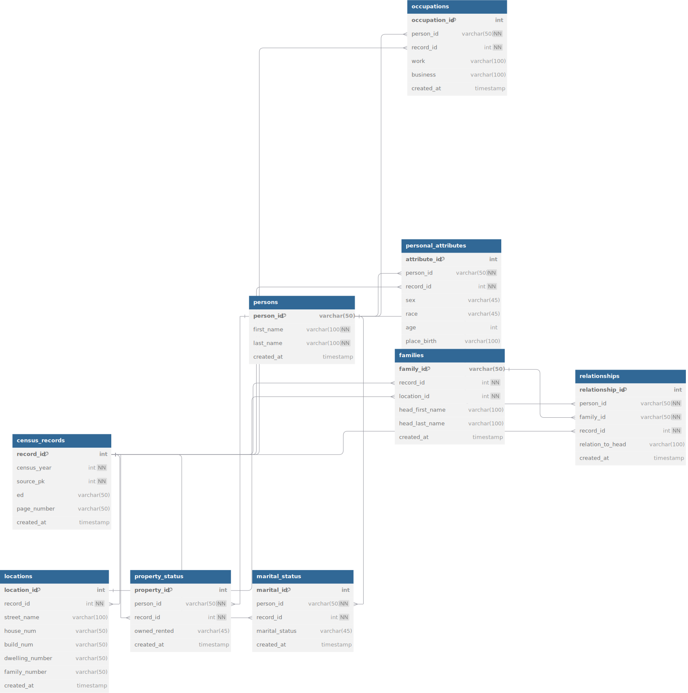
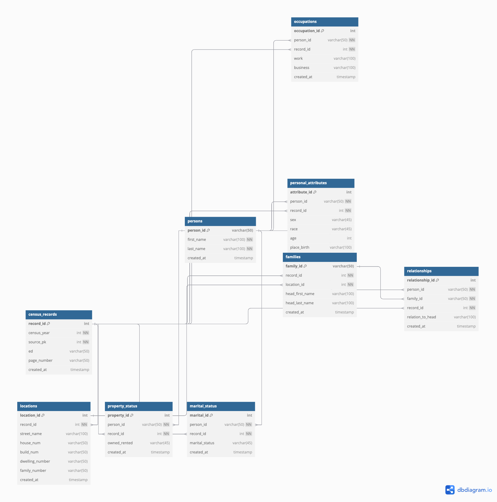
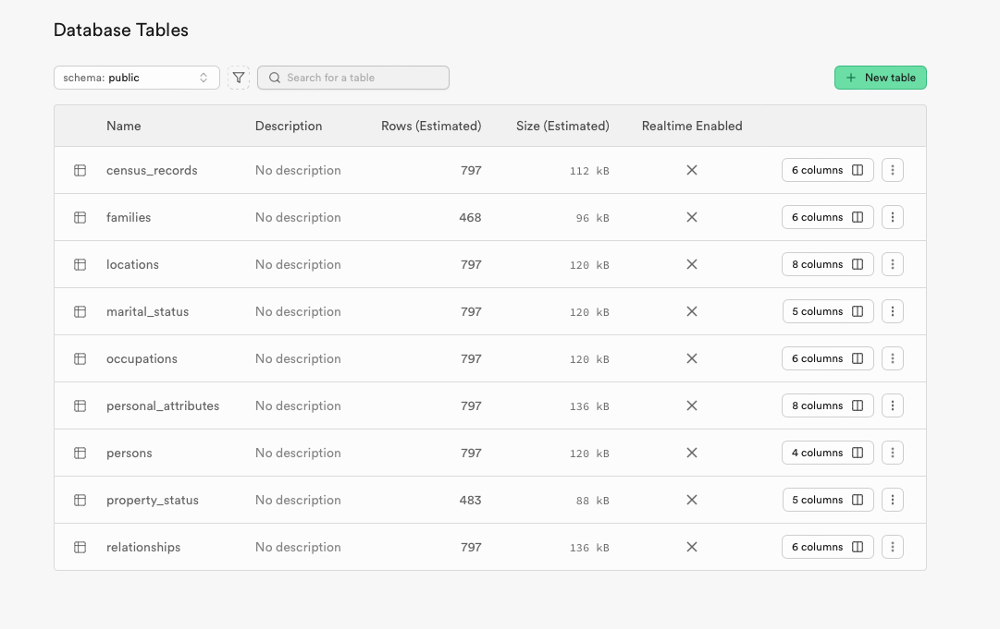
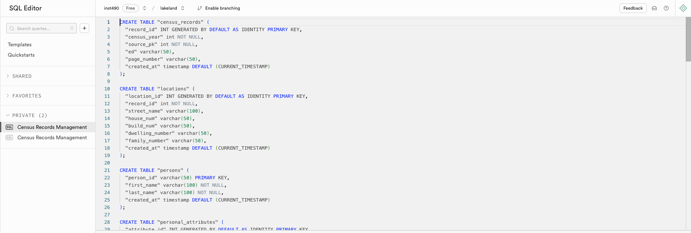
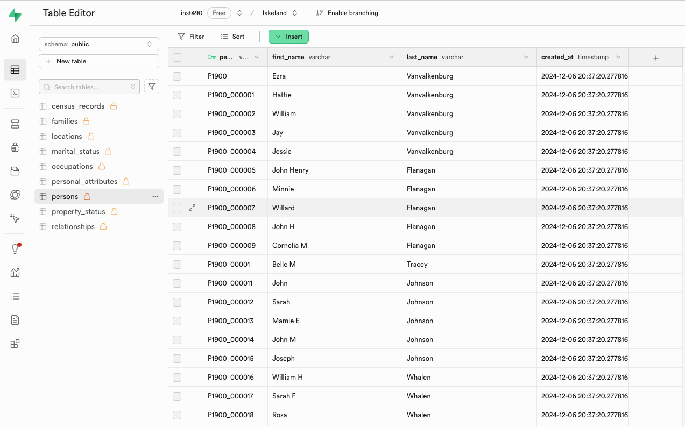
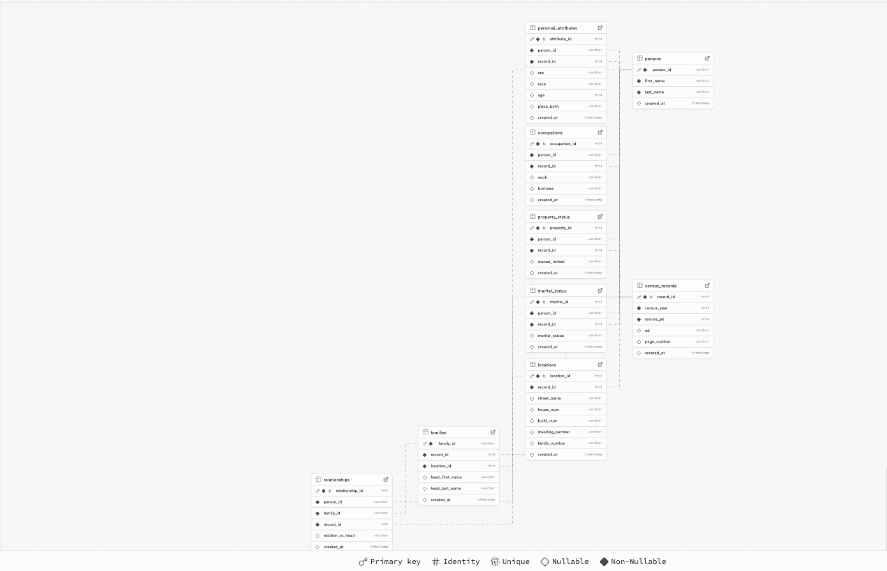

# Lakeland Census Data ETL Project

This repository contains an ETL (Extract, Transform, Load) pipeline for processing historical census data from Lakeland. The project transforms raw census data into a structured database format and loads it into a Supabase PostgreSQL database.

## Table of Contents

- [Project Overview](#project-overview)
- [Database Schema](#database-schema)
- [Prerequisites](#prerequisites)
- [Setup Instructions](#setup-instructions)
- [Running the ETL Pipeline](#running-the-etl-pipeline)
- [Database Structure](#database-structure)
- [Troubleshooting](#troubleshooting)

## Project Overview

The project processes historical census records from multiple years and organizes them into a normalized database structure. Here's what the final database structure looks like in Supabase:

 

## Database Schema

The database follows a normalized structure with clear relationships between tables:

### Visual Schema (ERD)

 

### Database Tables Overview

 

Current table statistics:

- census_records: 797 rows
- families: 468 rows
- locations: 797 rows
- persons: 797 rows
- relationships: 797 rows
- personal_attributes: 797 rows
- occupations: 797 rows
- property_status: 483 rows
- marital_status: 797 rows

## Prerequisites

1. Python 3.8 or higher
2. Supabase account and project
3. Git (for cloning the repository)
4. PostgreSQL client (optional, for direct database access)

## Setup Instructions

### 1. Repository Setup

```bash
# Clone the repository
git clone <repository-url>
cd lakeland_transfer

# Create a virtual environment
python -m venv venv

# Activate the virtual environment
# On Windows:
venv\Scripts\activate
# On macOS/Linux:
source venv/bin/activate

# Install requirements
pip install -r requirements.txt
```

### 2. Database Schema Setup in Supabase

1. Go to [dbdiagram.io](https://dbdiagram.io)
2. Copy the contents of `ERD/dbdiagram.io/dbdiagram.io_schema.dbml`:

```sql
// Census Database Schema
Table census_records {
  record_id int [pk, increment]
  census_year int [not null]
  // ... rest of schema
}
// ... additional tables
```

3. In Supabase SQL Editor:
   

   - Create a new query
   - Paste the schema from (ERD/dbdiagram.io/ERD.sql)
   - Execute the query to create all tables

4. Verify table creation in Table Editor:
   

### 3. Environment Configuration

1. Copy the example environment file:

```bash
cp .env.example .env.local
```

2. Update `.env.local` with your Supabase credentials:

```plaintext
SUPABASE_URL=https://your-project-ref.supabase.co
SUPABASE_KEY=your-supabase-anon-key
```

You can find these credentials in your Supabase project settings:


## Running the ETL Pipeline

### 1. Data Transformation

1. Open Jupyter Notebook:

```bash
jupyter notebook
```

2. Navigate to `1.transform.ipynb`
3. Select your Python environment kernel
4. Run all cells sequentially
5. Watch for the "Move on to load" message

Expected output:

```
Processing census year 1900...
Processing census year 1920...
...
Move on to load
```

### 2. Data Loading

1. Open `2.load.ipynb`
2. Run all cells
3. Monitor the loading progress

Expected output:

```
Loading census_records...
Loading persons...
...
Data load complete
```

### 3. Verify Data Load

1. Check Supabase Table Editor:
   

2. Verify relationships in Database Visualizer:
   

## Database Structure

The database consists of interconnected tables with the following relationships:


Key tables and their purposes:

- `census_records`: Core table containing census year and source information
- `persons`: Individual person records with unique identifiers
- `families`: Family unit information
- `relationships`: Family member relationships
- `locations`: Address and dwelling information
- `personal_attributes`: Demographics (age, sex, race)
- `occupations`: Employment information
- `property_status`: Property ownership details
- `marital_status`: Marital status information

## Troubleshooting

### Common Issues

1. **Environment Setup Issues**

   - Ensure Python version compatibility
   - Verify all requirements are installed:
     ```bash
     pip list | grep -E "pandas|numpy|supabase"
     ```
   - Check virtual environment activation

2. **Database Connection Issues**

   - Verify Supabase credentials in `.env.local`
   - Test connection:

     ```python
     import os
     from supabase import create_client

     url = os.environ.get("SUPABASE_URL")
     key = os.environ.get("SUPABASE_KEY")
     supabase = create_client(url, key)
     ```

3. **Data Loading Issues**
   - Check CSV file formats
   - Verify column names match schema
   - Ensure proper data types
   - Monitor foreign key constraints

### Getting Help

If you encounter issues:

1. Check the error messages in the notebook outputs
2. Verify table structure in Supabase Table Editor
3. Review the ERD for correct relationships
4. Check the transformation logs in the notebook

For additional support, please refer to:

- Supabase documentation
- Project issues page
- Data transformation logs
